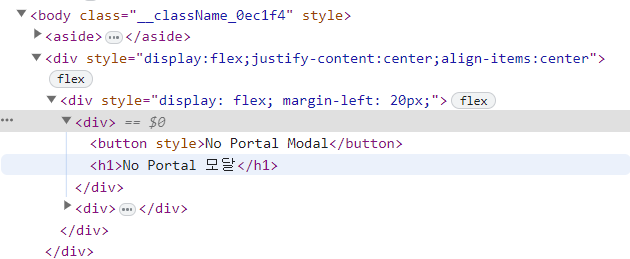
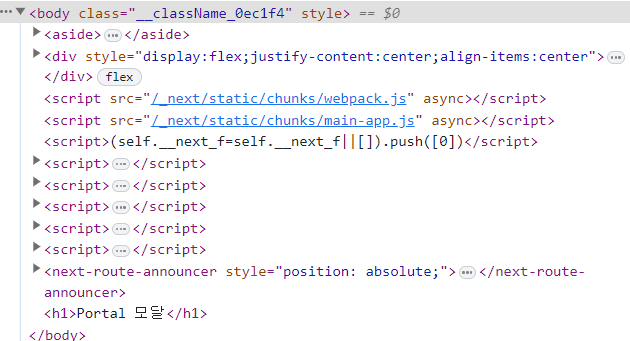

# React Deep Dive
### 2023.05.11 ~
#### [실습 Repo](https://github.com/SeolJaeHyeok/dirkr-examples)

# Core React

### 1. JSX란 무엇인가?

JSX는 JavaScript XML의 약자로, ECMAScript의 XML과 유사한 구문 확장이다.
기본적으로 `React.createElement(type, props, ...children)` 함수의 syntatic sugar(구문적 설탕)을 제공하여 템플릿 구문과 같은 HTML과 함께 JavaScript를 표현할 수 있다.

아래 예시는 텍스트를 가진 `h1` 태그를 반환하는 render function이다. 일반적으로 우리가 익숙하게 쓰는 방식과 유사한 문법으로 JSX를 사용할 수 있다.

```javascript
export default function App() {
  return <h1 className='greeting'>{"Hello, this is a JSX Code!"}</h1>;
}
```

만약 JSX를 사용하지 않는다면 아래와 같이 작성해야만 React를 사용할 수 있을 것이다.

```javascript
import { createElement } from "react";

export default function App() {
  return createElement(
    "h1",
    { className: "greeting" },
    "Hello, this is a JSX Code!"
  );
}
```

### 2. Element와 Component의 차이는 무엇인가?

Element는 화면에 표시할 내용을 DOM Node 또는 기타 컴포넌트로 설명하는 일반 객체다.
Element는 프로퍼티에 다른 Element를 포함(children)할 수 있다.
React Element를 만드는 것은 값싼 연산이고 일단 생성되면 변경할 수 없다.

React Element를 JavaScript로 표현하면 다음과 같다.

```javascript
const element = React.createElement("div", { id: "login-btn" }, "Login");
```

그리고 이것은 JSX를 사용해 단순화할 수 있다.

```html
<div id="login-btn">Login</div>
```

`React.createElement()` 함수는 아래와 같은 객체를 반환한다.

```javascript
{
  type: 'div',
  props: {
    children: 'Login',
    id: 'login-btn'
  }
}
```

마지막으로 `ReactDOM.render()` 함수를 사용해 Element를 DOM에 렌더링한다.

컴포넌트는 여러 방식으로 선언될 수 있다. `render()` 함수를 사용해 Class로 만들 수도 있고, 함수로 정의할 수도 있다. 어떤 경우든 props를 입력으로 받고 JSX 트리를 출력으로 반환한다.

```javascript
const Button = ({ handleLogin }) => (
  <div id={"login-btn"} onClick={handleLogin}>
    Login
  </div>
);
```

이후 JSX는 `React.createElement()` 함수 트리로 변환된다.

```javascript
const Button = ({ handleLogin }) =>
  React.createElement(
    "div",
    { id: "login-btn", onClick: handleLogin },
    "Login"
  );
```

### 3. 순수 컴포넌트가 무엇인가?

순수 컴포넌트는 동일한 state와 props에 대해 항상 동일한 출력을 렌더링하는 컴포넌트를 말한다.
함수 컴포넌트에서는 `React.memo()` 를 통해 순수 컴포넌트를 만들 수 있다. `React.memo()` API는 이전 props와 새로운 props를 얕은 비교를 통해 비교하여 불필요한 리렌더링을 방지한다.

하지만 함수 컴포넌트 자체에서 동일한 상태를 다시 설정할 때 기본적으로 불필요한 렌더링을 방지하기 때문에 이전 상태와 현재 상태를 비교하지 않는다.

Memoized 된 컴포넌트는 아래와 같이 표현된다.

```javascript
const MemoizedComponent = memo(SomeComponent, arePropsEqual?);
```

아래는 `React.memo()` API를 통해 하위 컴포넌트의 불필요한 렌더링을 방지하는 예시다.

```javascript
import { memo, useState } from "react";

const EmployeeProfile = memo(function EmployeeProfile({ name, email }) {
  return (
    <>
      <p>Name:{name}</p>
      <p>Email: {email}</p>
    </>
  );
});
export default function EmployeeRegForm() {
  const [name, setName] = useState("");
  const [email, setEmail] = useState("");
  return (
    <>
      <label>
        Name: <input value={name} onChange={(e) => setName(e.target.value)} />
      </label>
      <label>
        Email:{" "}
        <input value={email} onChange={(e) => setEmail(e.target.value)} />
      </label>
      <hr />
      <EmployeeProfile name={name} />
    </>
  );
}
```

위 코드에서는 이메일 props가 하위 컴포넌트로 전달되지 않았다. 따라서 이메일 props 변경에 대한 리렌더링이 발생하지 않는다.

클래스 컴포넌트에서는 React.Component 대신 React.PureComponent를 확장하는 컴포넌트가 순수 컴포넌트가 된다.
props나 state가 변경되면 PureComponent는 shouldComponentUpdate() 수명 주기가 충족되면 props나 state 모두에 대해 얕은 비교를 수행한다.

> Note:
>
> 1. `React.memo()` 는 HOC이다.
> 2. `shouldComponentUpdate` 라이프사이클 메서드를 통해 임의의 조건을 설정해 리렌더링을 방지할 수 있다.
> 3. `shouldComponentUpdate` 가 반환하는 기본값은 `true`다. 따라서 이 메서드 안에서 로직을 통해 `true` 나 `false`를 반환하면 개발자가 지정한 조건 하에 리렌더링을 발생시킬 수 있다.

### 4. State란 무엇인가?

컴포넌트의 state는 *컴포넌트의 수명에 따라 변경될 수 있는 일부 정보를 저장하는 객체*다.<br />
중요한 점은 state가 변경되면 리렌더링을 발생시킨다는 것이다. 그렇기 때문에 state를 가능한 단순하게 만들고 Stateful Component를 최소화 하는 것이 좋다.

state는 props와 비슷하지만 private하며 컴포넌트에 의해 완전히 제어된다. 즉, state를 가진 컴포넌트가 전달하기 전까지 다른 컴포넌트가 해당 state에 접근할 수 없다.

### 5. Props란 무엇인가?

Props는 컴포넌트에 대한 입력(값)이다. Props를 HTML의 Attribute와 유사하게 생성 시 컴포넌트에 전달되는 값이다. 여기서 전달되는 데이터의 흐름은 부모 컴포넌트에서 자식 컴포넌트로 이루어진다.

React에서 Props의 주요 목적은 다음과 같은 컴포넌트의 기능을 제공하는 것이다.

1. 컴포넌트에 사용자 정의 데이터를 전달한다.
2. 상태 변경을 일으킨다.
3. 컴포넌트의 `render()` 메서드 내에서 `this.props.whatever`을 통해 사용한다.

이 whatever의 속성 이름은 원래 React 라이브러리를 사용해 생성된 모든 컴포넌트에 이미 존재하는 React의 네이티브 props 객체에 연결된 property가 된다.

함수 컴포넌트에서 props는 아래와 같이 사용 가능하다.

```javascript
import React from "react";
import ReactDOM from "react-dom";

const ChildComponent = (props) => {
  return (
    <div>
      <p>{props.name}</p>
      <p>{props.age}</p>
    </div>
  );
};

const ParentComponent = () => {
  return (
    <div>
      <ChildComponent name='John' age='30' />
      <ChildComponent name='Mary' age='25' />
    </div>
  );
};
```

props 객체 안에 연결된 모든 property는 ES6에서 추가된 destructing을 통해 직접적으로 접근할 수 있다.

```javascript
const ChildComponent = ({ name, age }) => {
  return (
    <div>
      <p>{name}</p>
      <p>{age}</p>
    </div>
  );
};
```

### 6. State와 Props의 차이

React에서 state와 props는 모두 일반 자바스크립트 객체이며 컴포넌트의 데이터를 관리하는 데 사용되지만, 서로 다른 방식으로 사용되며 다른 특성을 가지고 있다.

State:

- state는 컴포넌트 내의 내부 데이터 저장 메커니즘이다.
- 컴포넌트의 lifecycle 동안 시간이 지남에 따라 변경될 수 있는 정보를 나타낸다.
- state는 컴포넌트 자체에서 소유하고 제어한다.
- 클래스 컴포넌트의 생성자에서 또는 기능적 컴포넌트의 useState 후크를 사용하여 상태를 초기화할 수 있다.
- state는 setState 메서드(클래스 컴포넌트) 또는 업데이트 기능(funtinoal 컴포넌트)을 사용하여 소유한 컴포넌트 내에서만 수정할 수 있다.
- state가 변경되면 React는 state 업데이트의 영향을 받는 컴포넌트 및 해당 하위 컴포넌트의 다시 렌더링을 자동으로 트리거한다.

Props:

- props(properties의 약자)는 상위 컴포넌트에서 하위 컴포넌트로 데이터를 전달하는 데 사용된다.
- props는 읽기 전용(readonly)이며 자식 컴포넌트에서 수정할 수 없다.
- props는 컴포넌트 트리를 통해 부모 컴포넌트에서 자식 컴포넌트로 전달된다.
- props는 부모 컴포넌트에서 정의되고 값이 할당된 다음 this.props(클래스 컴포넌트)를 사용하거나 매개 변수(기능 컴포넌트)로 자식 컴포넌트 내에서 액세스할 수 있다.
- 상위 컴포넌트의 props을 변경하면 업데이트된 props으로 하위 컴포넌트가 다시 렌더링된다.
- props는 데이터를 전달하고 컴포넌트 간에 통신하는 방법을 제공하여 컴포넌트 구성 및 재사용을 가능하게 한다.

요약하면 state는 *컴포넌트 내에서 변경 가능한 내부 데이터를 관리하는 데 사용*되는 반면 props는 *부모 컴포넌트에서 자식 컴포넌트로 데이터를 전달하는 데 사용*된다.<br />
state는 컴포넌트 자체가 소유하고 제어하는 ​​반면 props은 읽기 전용(readonly)이며 부모 컴포넌트에서 자식 컴포넌트로 전달된다.

### 7. State Update

state를 직접 업데이트하려 시도한다면, 리렌더링이 발생하지 않는다.

```javascript
this.state.message = "Hello world";
```

직접 업데이트 하는 대신 `setState()` 메서드를 사용해 state를 업데이트해야한다.
`setState()` 메서드는 state 객체의 업데이트를 예약(scheduling)한다.

```javascript
this.setState({ message: "Hello World" });
```

클래스 컴포넌트에서 사용하는 `setState()` 메서드의 두 번째 인자로 콜백 함수를 넘겨줄 수 있다.
콜백 함수는 setState가 완료되고 컴포넌트가 렌더링될 때 호출된다.

> Note:
>
> 하지만 이런 식으로 `setState()` 함수의 콜백 함수를 넘겨주는 것보다 라이프사이클 메서드를 사용하는 것이 낫다.
>
> ```javascript
> setState({ name: "John" }, () =>
>   console.log("The name has updated and component re-rendered")
> );
> ```

### 8. HTML과 React 사이의 이벤트를 다루는 방법의 차이

HTML과 React 이벤트 핸들링의 주된 차이는 아래와 같다.

1. HTML에서 이벤트는 `lowercase` 컨벤션을 따른다. 반면, React에서는 `camelCase` 컨벤션을 따른다.

   ```javascript
      // HTML
      <button onclick="clickEvent()">Click</button>

      // React
      <button onClick={clickEvent}>Click</button>
   ```

2. HTML에서 이벤트의 기본 동작을 막기 위해 `false` 를 반환할 수 있다. 반면, React에서는 반드시 `preventDefault()` 함수를 명시적으로 호출해야 한다.

   ```javascript
   // HTML
   <a href='#' onclick='clickEvent(); return false;'>
     Move
   </a>;

   // React
   function clickEvent(event) {
     event.preventDefault();
     console.log("Click");
   }
   ```

3. HTML에서는 함수 이름 앞에 `()`를 붙여 함수를 호출해야 하지만, React에서는 붙이면 안된다.

### 9. JSX 콜백에서 메서드 또는 이벤트 핸들러를 바인딩하는 방법

클래스 컴포넌트에서는 3가지의 방법이 존재한다.

1. Binding in Constructor: 자바스크립트 클래스에서 메서드는 기본적으로 바인딩되지 않는다. 클래스 메서드로 선언된 React 이벤트 핸들러 또한 동일한 규칙이 적용된다. 일반적으로 바인딩을 생성자에서 이루어진다.
   ```javascript
   class User extends Component {
     constructor(props) {
       super(props);
       this.handleClick = this.handleClick.bind(this);
     }
     handleClick() {
       console.log("SingOut triggered");
     }
     render() {
       return <button onClick={this.handleClick}>SingOut</button>;
     }
   }
   ```
2. Public class fields syntax: Bind 메서드를 사용하고 싶지 않다면 *public class fields syntax*를 사용하여 콜백을 올바르게 바인딩할 수 있다.

   ```javascript
   handleClick = () => {
     console.log("SingOut triggered", this);
   };

   <button onClick={this.handleClick}>SingOut</button>;
   ```

3. Arrow functions in callbacks: 콜백 함수 안에 직접 화살표 함수를 사용하는 것도 가능하다.
   ```javascript
   handleClick() {
       console.log('SingOut triggered');
   }
   render() {
       return <button onClick={() => this.handleClick()}>SignOut</button>;
   }
   ```

### 10. React의 synthetic events

Synthetic Event는 브라우저의 Native Event를 감싼 크로스 브라우저 래퍼다. 이 이벤트는 모든 브라우저에서 동일하게 작동한다는 점을 제외하면 stopPropagation() 및 preventDefault() 등 브라우저의 네이티브 이벤트와 동일한 인터페이스를 가지고 있다.

어떤 이유로 기본 브라우저 이벤트가 필요한 경우 nativeEvent 속성을 사용하여 해당 이벤트를 가져오면 된다. 합성 이벤트는 브라우저의 기본 이벤트와 다르며 직접 매핑되지 않는다.

합성 이벤트 객체에는 이벤트 유형(event type), 대상 요소(target element), 이벤트 좌표(event coordinate)와 같은 네이티브 이벤트 객체와 동일한 프로퍼티와 메서드가 포함되어 있다. 하지만 일관된 동작을 보장하고 automatic event pooling과 같은 추가 기능을 제공하여 성능을 향상시킨다.

SyntheticEvent의 중요한 특징 중 하나는 풀링된 객체라는 점이다. 즉, 이벤트 핸들러가 실행을 완료한 후 SyntheticEvent 객체가 재사용되고 해당 프로퍼티가 무효화된다. 이 풀링은 각 이벤트에 대해 새 객체를 생성하지 않도록 하여 메모리 사용량을 줄이고 성능을 개선하는 데 도움이 된다.

```javascript
// No Pooling
function handleChange(e) {
  // This won't work because the event object gets reused.
  setTimeout(() => {
    console.log(e.target.value); // Too late!
  }, 100);
}

// Pooling
function handleChange(e) {
  // Prevents React from resetting its properties:
  e.persist();

  setTimeout(() => {
    console.log(e.target.value); // Works
  }, 100);
}
```

> Note
>
> React가 예전 브라우저에서 성능을 위해 서로 다른 이벤트 사이에 이벤트 객체를 재사용하고, 그 사이에 모든 이벤트 필드를 null로 설정했었다. React 16 이하에서는 이벤트를 제대로 사용하려면 e.persist()를 호출하거나 필요한 프로퍼티를 먼저 읽어야만 했다.
>
> 하지만 React 17버전에서는 Pooling이 모던 브라우저에서 성능 개선을 하지 못한다고 판단하여 event pooling이 제거됐다. 따라서 React 17 이후에는 `e.persist()` 가 아무런 동작도 하지 않는다.

### 11. React key props

key는 element 배열을 만들 때 포함해야 하는 특별한 attribute다. key 프로퍼티는 React가 어떤 항목이 변경, 추가 또는 제거되었는지 식별하는 데 도움이 된다.
key는 형제들 사이에서 고유해야 하므로 대부분의 경우 데이터의 ID를 key로 사용한다.

```javascript
const todoItems = todos.map((todo) => <li key={todo.id}>{todo.text}</li>);
```

key는 React가 Element를 만들 때 각 컴포넌트의 인스턴스를 식별하는 고유한 식별자로서 역할을 한다. key는 단지 React를 위한 prop으로 동작하기 때문에 `props.key` 와 같이 접근할 수 없다.

key는 인스턴스를 식별하는 고유한 식별자로 동작하기 때문에 해당 key가 변경되면 이전 컴포넌트의 인스턴스와 DOM을 파괴하고 새롭게 컴포넌트를 생성한다.

만약 `<Form key={selectedItem.key} />` 와 같이 렌더링한다고 하면 선택된 아이템이 변경될 때마다 이전에 생성된 `Form` 컴포넌트의 인스턴스와 DOM을 파괴하고 새롭게 생성한다. 따라서 폼 내에 오래된 상태로 인한 문제가 발생하지 않는다.

> Note
>
> 배열 요소의 key로 인덱스를 사용하는 경우도 있다. 실제로 React는 key를 지정하지 않으면 index를 사용한다. 하지만 요소가 삽입되거나 삭제되는 경우 또는 배열의 순서가 바뀌는 경우에는 시간이 지남에 따라 항목을 렌더링하는 순서가 변경된다. 이럴 경우 index를 key로 사용할 때 예상치 못한 버그가 발생할 수 있다.
>
> 또한 `Math.random()`과 같이 즉석에서 key를 생성하는 것도 지양해야 한다. 이렇게 하게 되면 렌더링 간의 key가 일치하지 않아 모든 컴포넌트의 인스턴스와 DOM을 파괴하고 새로 생성하게 된다. 이는 속도가 느려질뿐만 아니라 만약 이를 의도하지 않았다면 요소 내부의 유저의 입력도 잃게 된다.

### 12. ref

ref는 요소에 대한 참조를 반환하는 데 사용된다. 대부분의 경우 사용하지 않는 것이 좋지만, DOM 요소나 컴포넌트의 인스턴스에 직접 액세스해야 할 때 유용할 수 있다.

> ref를 사용하지 않아야 하는 이유
>
> 1. 렌더 트리에 불필요한 상태를 도입할 수 있다. useRef를 사용하여 DOM 요소에 대한 참조를 유지하는 경우 해당 요소가 렌더 트리에 있는 한 메모리에 유지된다.
> 2. 예기치 않은 동작을 일으킬 수 있다. 예를 들어, useRef를 사용하여 컴포넌트의 현재 상태를 유지하는 경우 사용자가 상태를 변경하면 컴포넌트가 다시 렌더링되지 않는다.
> 3. 1번과 같은 이유로 성능 저하의 원인이 될 수 있다.

### 13. forward refs란?

Ref forwarding(참조 전달)은 컴포넌트가 받은 ref를 가져와 하위 컴포넌트로 전달할 수 있는 기능이다.
`forwardRef` 로 감싼 컴포넌트는 두 번째 매개 변수를 갖게 되는데, 이를 통해 ref를 전달받을 수 있다.

```javascript
import React, { forwardRef, useRef } from "react";

const Input = forwardRef((props, ref) => {
  return <input type='text' ref={ref} />;
});

function Field() {
  const inputRef = useRef(null);

  function handleFocus() {
    inputRef.current.focus();
  }

  return (
    <>
      <Input ref={inputRef} />
      <button onClick={handleFocus}>입력란 포커스</button>
    </>
  );
}
```

### 14. Virtual DOM은 어떻게 동작하는가?

Virtual DOM은 세 가지의 간단한 과정으로 동작한다.

1. 데이터가 변경될 때마다 전체 UI가 가상 DOM 표현으로 다시 렌더링된다.
2. 그 후, 이전 DOM과 새로운 DOM의 차이를 계산한다.(reconciliation)
3. 계산이 완료되면 실제 DOM에는 변경된 내용만 업데이트된다.

> _Virtual DOM이라는 용어에 대한 Dan Abramov의 입장_
>
> 저는 우리가 "가상 DOM"이라는 용어를 폐기할 수 있길 바랍니다.
>
> 2013년에는 지금과 달리 이렇게 이야기 하지 않으면 사람들은 리액트가 모든 렌더에서 DOM 노드를 생성한다고 생각했기 때문에 의미가 있었습니다.
>
> 그러나 오늘날 사람들은 이런 가정을 거의 하지 않습니다. "가상 DOM"은 일부 DOM 문제에 대한 해결 방법처럼 들리지만 리액트는 그런 것이 아닙니다.
>
> 리액트는 "값 UI"입니다. 그것의 핵심 원칙은 UI가 문자열이나 배열과 마찬가지로 값이라는 것입니다. 변수에 저장하고, 전달하고, 자바스크립트 제어 흐름에서 사용할 수 있습니다. 그 표현가능함이 요점입니다. DOM에 변경 사항을 적용하는 것을 피하기 위한 비교 같은 것이 아닙니다.
>
> 항상 DOM을 나타내는 것도 아닙니다. 예를 들어 `<Message recipientId={10} />`는 DOM이 아닙니다. 개념적으로 이는 지연 함수 호출 `Message.bind(null, { recipientId: 10 })`를 나타냅니다.

리액트는 기존 컴포넌트 트리와 DOM 구조를 가능한 많이 재활용하여 효율적인 리렌더링을 위해 재조정(Reconciliation) 과정을 거친다.

- **재조정(Reconciliation)이란?**

  만약 `ReactDOM.render()` 가 같은 컨테이너에서 두 번 호출된다면 어떻게 될까?

  ```jsx
  ReactDOM.render(
    <button className='blue' />,
    document.getElementById("container")
  );

  // ... 나중에 ...

  // 호스트 객체를 교체해야 할까
  // 아니면 기존 객체에 속성만 교체하면 될까?
  ReactDOM.render(
    <button className='red' />,
    document.getElementById("container")
  );
  ```

  - React의 목표는 주어진 **React 엘리먼트 트리와 호스트 트리를 일치시키는 것**이다.
    새로운 정보를 가지고 **호스트 객체 트리에 어떤 작업을 해야 하는지를 파악하는 과정**이 조정(\***\*Reconciliation)\*\***이라고 한다.
  - 여기에는 두 가지 방법이 존재한다.

    - 기존 정보를 날리고 새로운 트리를 생성
      ```jsx
      let domContainer = document.getElementById("container");
      // 트리를 날린다.
      domContainer.innerHTML = "";
      // 새로운 객체 트리를 만든다.
      let domNode = document.createElement("button");
      domNode.className = "red";
      domContainer.appendChild(domNode);
      ```
      위 방법의 단점은 느리고 포커스, 선택, 스크롤 정보 등 중요한 정보를 잃게 된다. 대신 아래와 같이 우리가 원하는 방향으로 작업할 수도 있다.
      ```jsx
      let domNode = domContainer.firstChild;
      // 기존 호스트 객체를 변경한다.
      domNode.className = "red";
      ```
      같은 위치에 같은 호스트 객체를 다시 렌더링 하는 것이기 때문에 다시 만들 필요 없이 재사용하면 된다.
    - **트리의 같은 위치에 있는 엘리먼트 타입이 이전 렌더링과 다음 렌더링 사이에 일치하면 React는 기존 호스트 객체를 다시 사용한다.**

      ```jsx
      // let domNode = document.createElement('button');
      // domNode.className = 'blue';
      // domContainer.appendChild(domNode);

      ReactDOM.render(
        <button className='blue' />,
        document.getElementById("container")
      );

      // 호스트 객체를 다시 사용할 수 있을까? 네! (button → button)
      // domNode.className = 'red';

      ReactDOM.render(
        <button className='red' />,
        document.getElementById("container")
      );

      // 호스트 객체를 다시 사용할 수 있을까? 아뇨! (button → p)
      // domContainer.removeChild(domNode);
      // domNode = document.createElement('p');
      // domNode.textContent = 'Hello';
      // domContainer.appendChild(domNode);

      ReactDOM.render(<p>Hello</p>, document.getElementById("container"));

      // 호스트 객체를 다시 사용할 수 있을까? 네! (p → p)
      // domNode.textContent = 'Goodbye';
      ReactDOM.render(<p>Goodbye</p>, document.getElementById("container"));
      ```

  ### 조건(Conditions)

  - 매 갱신마다 엘리먼트의 타입이 일치할 때만 호스트 객체를 재활용한다면 조건부 렌더링의 경우는 어떻게 동작할까?

    ```jsx
    // 첫 렌더링
    ReactDOM.render(
      <dialog>
        <input />
      </dialog>,
      domContainer
    );

    // 두 번째 렌더링
    ReactDOM.render(
      <dialog>
        <p>I was just added here!</p>
        <input />
      </dialog>,
      domContainer
    );
    ```

  - 위 예제에서 `input` 호스트 객체는 재생성될 것이다. 이미 존재하는 `input` 호스트 객체를 재활용하지 않고 재생성하는 과정은 아래와 같다.
    - `dialog → dialog`: 호스트 객체를 다시 사용할 수 있나요? **네, 타입이 일치합니다.**
    - `input → p`: 호스트 객체를 다시 사용할 수 있나요? **아뇨, 타입이 다릅니다.**
    - `input`을 삭제하고 `p`를 추가해야 합니다.
    - `(없음) → input`: 새로운 `input` 호스트 객체를 만들어야 합니다.
  - 따라서 React가 실행하는 코드는 다음과 같다.

    ```jsx
    let oldInputNode = dialogNode.firstChild;
    dialogNode.removeChild(oldInputNode);

    let pNode = document.createElement("p");
    pNode.textContent = "I was just added here!";
    dialogNode.appendChild(pNode);

    let newInputNode = document.createElement("input");
    dialogNode.appendChild(newInputNode);
    ```

  - 새로 생성하게 되면 선택, 포커스, 내용을 잃기 때문에 재생성은 불필요한 과정이 된다.

### 15. Fiber 객체는 무엇인가?

Fiber 객체는 React 16에 처음 적용된 새로운 재조정 엔진이다. React Fiber는 애니메이션, 레이아웃, 제스처, 작업 일시정지, 중단, 재사용 기능 등 다양한 유형의 업데이트에 우선순위를 할당하고 새로운 concurrency primitives와 같은 영역에 대한 적합성을 높이는 것을 목표로 한다.

대표적인 기능은 증분 렌더링(incremental rendering)으로, 렌더링 작업을 청크로 분할아여 여러 프레임에 걸쳐 분산할 수 있는 기능이다.

Fiber 객체의 주된 목표는 아래와 같다.

1. 중단 가능한 작업을 청크로 분할하는 기능
2. 진행 중인 작업의 우선순위를 정하고, rebase하고 reuse할 수 있는 기능
3. React에서 레이아웃을 지원하기 위해 부모와 자식 간에 양보할 수 있는 기능
4. `render()`에서 여러 요소를 반환하는 기능
5. Error boundaries에 대한 더 나은 지원

> ### concurrency primitives
>
> 동시성 프리미티브(concurrency primitives)는 동시 스레드 또는 프로세스 간에 동기화 및 조정을 제공하는 프로그래밍 구조 또는 메커니즘이다.
>
> 이러한 프리미티브는 공유 리소스를 관리하고 동시 프로그램에서 정확하고 예측 가능한 동작을 보장하는 데 필수적이다.

Fiber 객체 타입을 간단히 나타내면 다음과 같다.

```javascript
export type Fiber = {
  // 파이버 타입을 식별하기 위한 태그
  tag: WorkTag,

  // 해당 요소의 고유 식별자
  key: null | string,

  // 파이버와 관련된 것으로 확인된 함수/클래스
  type: any,

  // 단일 연결 리스트 트리 구조
  child: Fiber | null,
  sibling: Fiber | null,
  index: number,

  // 파이버로 입력되는 데이터 (arguments/props)
  pendingProps: any,
  memoizedProps: any, // 출력을 만드는데 사용되는 props입니다.

  // 상태 업데이트 및 콜백 큐
  updateQueue: Array<State | StateUpdaters>,

  // 출력을 만드는데 사용되는 상태
  memoizedState: any,

  // 파이버에 대한 종속성(컨텍스트, 이벤트)(존재하는 경우)
  dependencies: Dependencies | null,
};
```

렌더링 패스 동안 React는 이 Fiber 객체 트리를 순회하고 새 렌더링 결과를 계산할 때 업데이트된 트리를 구성한다.

중요한 점은 Fiber 객체는 실제 컴포넌트의 props와 state 값을 저장한다는 것이다. 다시 말해, 컴포넌트에서 props와 state를 사용할 때 **React는 Fiber 객체에 저장된 값에 대한 접근을 제공한다**는 것이다.

### 16. controlled component and uncontrolled component - [examples](https://github.com/SeolJaeHyeok/dirkr-examples/tree/main/app/controlled-uncontrolled)

제어 컴포넌트(controlled component)는 프로퍼티를 통해 현재 값과 업데이트 콜백 함수를 전달 받고, 부모 컴포넌트는 컴포넌트의 상태를 관리한다. 사용자가 컴포넌트와 상호작용하면 부모 컴포넌트가 상태를 업데이트하고, 이는 다시 컴포넌트의 값을 업데이트한다.

비제어 컴포넌트(uncontrolled component)는 자체 내부 상태를 유지하며, 사용자가 컴포넌트와 상호작용하면 자체 상태를 업데이트하고, 이는 다시 컴포넌트의 값을 업데이트 한다.

> ### 사용 예시
>
> 결제 시스템의 경우 사용자가 카드 정보를 입력하는 양식을 처리하는 데 제어 컴포넌트를 사용하면 양식 데이터가 상위 컴포넌트에서 관리되고 이를 바로 서버에 요청할 수 있다.
>
> 반면, 비제어 컴포넌트는 검색창 아래에 검색 결과가 표시되고 검색창의 상태가 컴포넌트 내부에서 관리되는 검색창과 같은 용도로 사용할 수 있다.

### 17. createElement와 cloneElement의 차이점은 무엇인가? - [examples](https://github.com/SeolJaeHyeok/dirkr-examples/tree/main/app/createElement-cloneElement)

`React.createElement()` 메서드는 엘리먼트를 생성하는 데 사용된다. JSX로 코드를 작성할 때마다 JSX는 이를 `React.createElement()`로 변환한다. `createElement` 메서드는 유지보수나 디버깅이 매우 어렵기 때문에 사용하지 않는 것이 좋다. 어떠한 `attribute`가 없는 `span` 태그일지라도 React 엘리먼트를 생성하려면 매번 `React.createElement()` 메서드를 호출해야 한다.

```javascript
React.createElement(type, [props], [...children]);
```

부모 컴포넌트가 자식 컴포넌트의 프로퍼티를 추가하거나 수정하고자 할 때 `React.cloneElement()` 메서드를 사용한다. `React.cloneElement()` 함수는 주어진 엘리먼트의 복제본을 생성하며, 프로퍼티와 자식도 함수에 전달할 수 있다.

```javascript
React.cloneElement(element, [props], [...children]);
```

### 18. Component Lifecycle이란?

컴포넌트의 생명 주기에는 세 가지의 생명 주기 단계가 있다.

1. Mounting: 컴포넌트를 브라우저 DOM에 마운트할 준비가 된 단계다. 이 단계에서는 `constructor()`, `getDerivedStateFromProps()`, `render()` 및 `componentDidMount()` lifecycle method에서 초기화를 다룬다.

2. Updating: 이 단계에서는 컴포넌트를 업데이트하는 두 가지 방법이 있는데, 새 프로퍼티를 전송하고 `setState()` 또는 `forceUpdate()`를 통해 상태를 업데이트하는 것다. 이 단계에서는 `getDerivedStateFromProps()`, `shouldComponentUpdate()`, `render()`, `getSnapshotBeforeUpdate()` 및 `componentDidUpdate()` lifecycle method가 다뤄진다.

3. Unmounting: 이 마지막 단계에서는 컴포넌트가 더 이상 필요하지 않으며 브라우저 DOM에서 마운트 해제된다. 이 단계에는 `componentWillUnmount()` 수명 주기 메서드가 포함된다.

한 가지 주목할 점은 React 내부적으로 DOM에 **변경 사항을 적용할 때 단계**라는 개념이 있다는 것이다. 이는 다음과 같이 구분된다.

1. Render : 컴포넌트가 Side Effects 없이 렌더링된다. 이는 Pure 컴포넌트에 적용되며, 이 단계에서 React는 렌더링을 일시 중지, 중단 또는 다시 시작할 수 있다.

2. Pre Commit : 컴포넌트가 실제로 DOM에 변경 사항을 적용하기 전에 React가 `getSnapshotBeforeUpdate()`를 통해 DOM에서 읽을 수 있는 순간이 있다.

3. Commit : React는 DOM과 함께 작동하며 마운팅을 위해 `componentDidMount()`, 업데이트를 위해 `componentDidUpdate()`, 마운트 해제를 위해 `componentWillUnmount()`를 각각 최종 실행한다.

### React 16.3+ Lifecycle methods

**getDerivedStateFromProps**: render()를 호출하기 직전에 호출되며 모든 렌더링에서 호출된다.

**componentDidMount**: 첫 번째 렌더링 후 실행되며 모든 AJAX 요청, DOM 또는 상태 업데이트, 이벤트 리스너 설정이 발생해야 하는 곳에서 실행된다.

**shouldComponentUpdate**: 컴포넌트를 업데이트할지 여부를 결정한다. 기본적으로 true를 반환한다. 상태나 프로퍼티가 업데이트된 후 컴포넌트를 렌더링할 필요가 없다고 확신하는 경우 거짓 값을 반환할 수 있다. 컴포넌트가 새로운 prop을 수신할 경우 다시 렌더링하는 것을 방지할 수 있으므로 성능을 향상시킬 수 있다.

**getSnapshotBeforeUpdate**: 렌더링된 출력이 DOM에 커밋되기 직전에 실행돤다. 이 함수가 반환하는 모든 값은 componentDidUpdate()로 전달된다. 이 함수는 스크롤 위치 등 DOM에서 정보를 캡처하는 데 유용하다.

**componentDidUpdate**: 주로 prop이나 state 변경에 대한 응답으로 DOM을 업데이트하는 데 사용된다. shouldComponentUpdate()가 false를 반환하면 실행되지 않는다.

**componentWillUnmount**: 나가는 네트워크 요청을 취소하거나 컴포넌트와 연관된 모든 이벤트 리스너를 제거하는 데 사용된다.

#### 16.3 이상 버전 - [diagram](https://projects.wojtekmaj.pl/react-lifecycle-methods-diagram/)


### 19. HOC(Higher Order Component) - [Examples](https://github.com/SeolJaeHyeok/dirkr-examples/tree/main/app/HOC)

고차 컴포넌트는 컴포넌트를 인자로 받아 새로운 컴포넌트를 반환하는 함수다. 기본적으로 React의 컴포지션 특성에서 파생된 패턴이다.

HOC의 주요 목적은 코드 재사용, 관심사 분리를 가능하게 하고 여러 컴포넌트 간에 공통 기능을 공유할 수 있는 방법을 제공하는 것이다. 이를 통해 새로운 프로퍼티를 추가하거나 컴포넌트의 생명 주기를 조작하거나 다른 컴포넌트로 래핑하여 컴포넌트의 동작을 확장하거나 수정할 수 있다.

HOC는 다음과 같은 다양한 상황에서 유용하다.

1. 코드 재사용성: HOC는 다른 컴포넌트에 적용할 수 있는 특정 논리 또는 기능을 캡슐화한다. 이렇게 하면 코드 재사용이 촉진되고 여러 컴포넌트에서 유사한 코드가 복제되는 것을 방지할 수 있다.
2. 교차 절단 문제(Cross-Cutting Concerns): HOC는 인증, 로깅, 캐싱 또는 데이터 가져오기와 같은 교차 절단 문제를 처리하는 데 유용하다. 이를 통해 이러한 문제를 기본 컴포넌트 논리에서 분리하고 이러한 기능을 컴포넌트에 추가하는 재사용 가능한 방법을 제공할 수 있다.
3. Composition: HOC는 여러 HOC로 컴포넌트를 래핑하여 여러 동작 또는 기능을 함께 구성하는 데 사용할 수 있다. 이는 필요에 따라 다양한 기능을 결합할 수 있는 유연성을 제공한다.
4. 프로퍼티 조작(Props Manipulation): HOC는 컴포넌트에 전달된 prop을 가로채고 수정할 수 있다. 이는 래핑된 컴포넌트에 도달하기 전에 데이터를 보강하거나 변환하는 데 유용할 수 있다.

### 20. Context - [Examples](https://github.com/SeolJaeHyeok/dirkr-examples/tree/main/app/context)

일반적으로 부모 컴포넌트에서 자식 컴포넌트로 정보를 전달할 때는 프로퍼티를 통해 전달한다. 하지만 중간에 여러 컴포넌트를 거쳐야 하거나 앱의 여러 컴포넌트가 동일한 정보를 필요로 하는 경우 프로퍼티 전달은 장황하고 불편할 수 있다. Context를 사용하면 부모 컴포넌트가 프로퍼티를 통해 명시적으로 전달하지 않고도 그 아래 트리에 있는 모든 컴포넌트가 일부 정보를 사용할 수 있다.

하지만 Context를 사용하기 전 고려해야 하는 사항이 있다.

1. Props를 넘기는 방식으로 시작하기

   일반적인 경우에는 Props를 수십 개 사용하거나 Props Drilling이 발생할 가능성이 적다. 이런 경우 Props를 명시적으로 전달하는 것이 명확하게 어떤 데이터를 사용하는지를 표현할 수 있다.

   따라서 코드를 유지 보수할 때 데이터의 흐름을 더욱 쉽게 파악할 수 있게 된다.

2. 컴포넌트를 추출해서 JSX를 children으로 전달하기

   만약 Props를 전달할 때, 해당 데이터를 사용하지 않고 그저 전달하기만 하는 용도로 사용하는 컴포넌트가 있다면 해당 컴포넌트를 추출할 필요가 있다.

   예를 들어, `<Layout posts={posts} />` 대신, `Layout` 컴포넌트가 `children`을 props로 받아 사용하도록 하여 `<Layout><Posts posts={posts} /></Layout>`를 렌더링할 수 있게 변경할 수 있다.

   이렇게 하면 데이터를 지정하는 컴포넌트와 데이터를 필요로하는 컴포넌트 사이의 레이어가 줄어든다.

#### Context 사용 사례

1. Theming : 전역으로 사용해야 하는 Theme의 경우(EX.다크모드) Context를 사용해서 관리할 수 있다.
2. Current account : 여러 컴포넌트가 현재 로그인한 사용자를 알아야 하는 경우, 해당 상태를 Context에 넣어 관리하게 되면 어느 곳에서나 편리하게 해당 정보를 읽어올 수 있다. 또한 여러 개의 Context를 중첩해서 여러 계정을 동시에 관리할 수도 있다.
3. Routing : 대부분의 Routing Libarary들은 내부적으로 Context를 사용하여 현재 경로를 유지한다. Context를 사용해 모든 링크가 활성 상태인지 아닌지를 알 수 있다.
4. Managing state : 많은 상태를 전역으로 관리해야 하고 이를 여러 컴포넌트에서 수정해야 하는 경우 Context를 사용할 수 있다. Context와 함께 Reducer를 사용해서 복잡한 상태를 관리할 수 있다.

### 21. props 인자와 함께 super 생성자를 사용하는 목적이 무엇인가?

자식 클래스 생성자는 `super`가 호출되기 전까지 `this` 참조를 사용할 수 없다. 이는 ES6 하위 클래스에도 동일하게 동작한다.

`props` 인자를 `super()` 호출에 전달하는 이유는 자식 생성자에서 `this.props`를 접근하기 위해서다.

#### Props 전달

```javascript
class MyComponent extends React.Component {
  constructor(props) {
    super(props);

    console.log(this.props); // prints { name: 'John', age: 42 }
  }
}
```

#### Props 전달 X

```javascript
class MyComponent extends React.Component {
  constructor(props) {
    super();

    console.log(this.props); // this.props는 접근 불가능 , undefined

    // props 인자는 사용 가능
    console.log(props); // prints { name: 'John', age: 42 }
  }

  render() {
    // 생성자 함수 외부에서는 차이가 없다.
    console.log(this.props); // prints { name: 'John', age: 42 }
  }
}
```

위 예시에서 볼 수 있듯 `this.props` 는 생성자 함수 내부에서만 다르게 동작하고 외부에서는 동일하다.

### 22. lazy function이 named export를 지원하는가?

먼저 `named export`와 `default export`의 차이에 대해서 살펴보자.

**named export**

한 파일 내에서 여러 변수, 함수, 클래스 등은 export 할 수 있다. 단, import 할 때 export 된 이름과 동일하게 import를 해야만 한다.

만약 다른 이름으로 사용하고 싶다면 `as` 키워드를 사용해서 변경해주면 된다. `*`를 사용하면 해당 파일 내에 있는 모든 export 된 변수, 클래스 등을 한 번에 가져올 수 있다.

**default export**

default로 선언된 모듈은 하나의 파일에서 단 하나의 변수, 클래스, 함수 등만 export할 수 있다. import 할 때는 어떠한 이름으로 선언해도 상관이 없다. 단, `var`, `let`, `const` 키워드로 선언된 변수를 export default 하는 것은 불가능하다.

질문으로 돌아와서 결론부터 말하면 `React.lazy` 함수는 default export만 지원한다. 하지만 named export로 모듈을 가져오는 방법이 있는데 default로 다시 export하는 중간 모듈을 만들면 된다.

이는 트리 셰이킹이 동일하게 발생하고 사용하지 않는 컴포넌트를 다시 가져오지 않도록 보장한다.

```javascript
// MoreComponents.js
export const SomeComponent = /* ... */;
export const UnusedComponent = /* ... */;
```

그 후 `MoreComponents.js` 컴포넌트를 다시 export 하는 중간 모듈 컴포넌트 `IntermediateComponent.js`을 만들어준다.

```javascript
export { SomeComponent as default } from "./MoreComponents.js";
```

이제 `lazy` 함수를 사용해서 컴포넌트를 불러올 수 있다.

```javascript
import React, { lazy } from "react";
const SomeComponent = lazy(() => import("./IntermediateComponent.js"));
```

### 23. Fragment가 무엇인가?
Fragment를 사용하면 DOM에 노드를 추가하지 않고 자식 엘리먼트들을 그룹화할 수 있다. `<Fragment></Fragment>` 혹은 `<></>`를 사용해야 한다.

```javascript
function Story({title, description, date}) {
  return (
      <Fragment>
        <h2>{title}</h2>
        <p>{description}</p>
        <p>{date}</p>
      </Fragment>
    );
}
```

또한 `key` prop을 사용해서 리스트를 렌더링할 수도 있다. 물론 일반적으로는 잘 사용하지 않는다.
```javascript
function StoryBook() {
  return stories.map(story =>
    <Fragment key={ story.id}>
      <h2>{story.title}</h2>
      <p>{story.description}</p>
      <p>{story.date}</p>
    </Fragment>
    );
}
```

Fragment가 DOM Element(Ex.div) 보다 선호되는 이유는 다음과 같다.

1. Fragment는 추가 DOM 노드를 생성하지 않기 때문에 조금 더 빠르며 메모리를 덜 사용한다. 단, 매우 크고 깊은 트리에서만 실질적인 이점이 있다.

2. Flexbox 및 CSS Grid와 같은 일부 CSS 메커니즘은 부모-자식 관계가 특수하므로 중간에 div를 추가하면 원하는 레이아웃을 유지하기가 어렵다.

3. DOM 인스펙터는 덜 복잡하다.

### 24. React에서 말하는 portals란? -[Examples](https://github.com/SeolJaeHyeok/dirkr-examples/tree/main/app/react-portal)
포털은 부모 컴포넌트의 DOM 계층 구조 외부에 존재하는 DOM 노드에 자식을 렌더링하는 권장 방법이다.

```javascript
import { createPortal } from 'react-dom';

// ...

<div>
  <p>This child is placed in the parent div.</p>
  {createPortal(
    <p>This child is placed in the document body.</p>,
    document.body
  )}
</div>
```
첫 번째 인수는 Element, 문자열 또는 Fragment와 같은 렌더링 가능한 React Element이고 두 번째 인수는 DOM Element다.

Portal은 DOM 노드의 물리적 배치만 변경한다. 즉, 다른 모든 면에서 Portal에 렌더링하는 JSX는 이를 렌더링 하는 React 컴포넌트의 자식 노드 역할을 한다. 예를 들어, 자식은 부모 트리가 제공하는 context에 접근할 수 있고, 이벤트는 React 트리에 따라 자식에서 부모로 버블링 된다.




### 25. Stateless Component, Stateful Component
Stateless Component는 상태를 하나고 가지고 있지 않은 다시 말해, 상태와 무관한 컴포넌트를 의미한다. 

Stateful Component는 상태에 따라 컴포넌트의 동작이 달라지는 컴포넌트를 의미한다. Stateful Component는 Hook을 사용하는 함수 컴포넌트 혹은 상태를 가진 클래스 컴포넌트다.

예를 들어, 버튼을 클릭함에 따라 숫자가 증가하는 컴포넌트는 Stateful Component가 된다.

```javascript
import React, {useState} from 'react';

const StatefulComponent = () => {
  const [count, setCount] = useState(0);
   
  const handleIncrement = () => {
     setCount(count+1);
  }

  return (
    <>
      <button onClick={handleIncrement}>Increment</button>
      <span>Counter: {count}</span>
    </>
  )
}

const App = (props) => {
   return (
    <>
      <StatefulComponent />
    </>
   )
}
```

반면, 자체적인 상태를 가지고 있지 않는 컴포넌트는 Stateless Component가 된다.

```javascript
import React from "react";

const StatelessComponent = () => {
  return <h1>Stateless Component</h1>
}

const App = () => {
  return <div>
    <StatelessComponent />
  </div>
}
```

그렇다면 아래와 같이 Props로 부모 컴포넌트의 상태를 전달 받은 자식 컴포넌트는 어떤 컴포넌트일까?

```javascript
import React, { useState } from "react"

const WhatIsThisComponent = ({ count, handleIncrement }) => {
  return (
    <>
      <button onClick={handleIncrement}>Increment</button>
      <span>Counter: {count}</span>
    </>
  )
}

const App = () => {
  const [count, setCount] = useState(0);

  const handleIncrement = () => {
    setCount(prev => prev + 1);
  }

  return ( 
    <>
      <WhatIsThisComponent count={count} handleIncrement={handleIncrement} />
    </>
  )
}
```

결론부터 말하면 자체 상태가 없지만 props로 값을 받는 컴포넌트는 Stateless Component로 간주된다. 이러한 컴포넌트는 순전히 Props로 받는 데이터를 기반으로 UI를 렌더링 하는 역할만을 주로 담당한다.

### 26. Error Boundaries
Error Boundaries는 자식 컴포넌트 트리 어느 곳에서나 Javascript 오류를 기록하고, 오류가 발생한 컴포넌트 트리 대신 Fallback UI를 표시하는 컴포넌트다.

